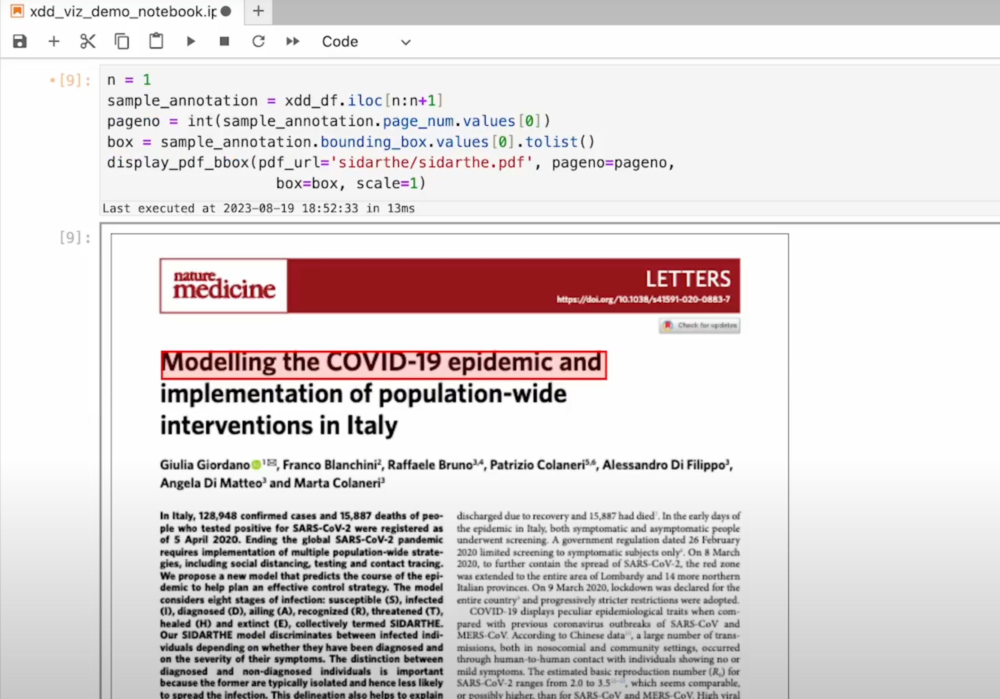

# ta1viewer
just some viewer tools for complex intermediates in TA1 askem. 
One of them shows boxes on top of pdf so you know where text came from as per XDD output.

If you have trouble installing let me know through the issues.

